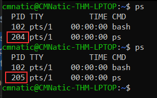

# Intro

## Intro To Researching

- Start from a question:
  - Example: How can I extract data from this image?
    - Search for an answer for this question and work your way through untill you have a full understanding of the topic.
This is a really good way to conduct research: Start with a question; get an initial understanding of the topic; then look into more advanced aspects as needed.

### Vulnerability scanning

Often in hacking you'll come across software that might be open to exploitation. For example, Content Management Systems (such as Wordpress, FuelCMS, Ghost, etc) are frequently used to make setting up a website easier, and many of these are vulnerable to various attacks. So where would we look if we wanted to exploit specific software?

The answer to that question lies in websites such as:

- [ExploitDB](https://www.exploit-db.com/)
- [NVD](https://nvd.nist.gov/vuln/search)
- [CVE Mitre](https://cve.mitre.org/)

**NVD** keeps track of CVEs (Common Vulnerabilities and Exposures) -- whether or not there is an exploit publicly available -- **so it's a really good place to look if you're researching vulnerabilities in a specific piece of software. CVEs take the form: CVE-YEAR-IDNUMBER**

**ExploitDB** tends to be very useful for hackers, as it often actually contains exploits that can be downloaded and used straight out of the box. **It tends to be one of the first stops when you encounter software in a CTF or pentest.**

If you're inclined towards the CLI on Linux, Kali comes pre-installed with a tool called "searchsploit" which allows you to search ExploitDB from your own machine. This is offline, and works using a downloaded version of the database, meaning that you already have all of the exploits already on your Kali Linux!

### Manual Pages

Get more information about a command by using the `man` functionality built in Linux!
If you don't know how to use a tool, `man` shoudl be your first port of call.

### Final Thoughts

You may have been told in school that there are good sources and bad sources of information. That may be true when it comes to essays and referencing information; however, it's my pleasure to state that it does not apply here. Any information can potentially be useful -- so feel free to use blogs, wikipedia, or anything else that contains what you're looking for! Blogs especially can often be very valuable for learning when it comes to information security, as many security researchers keep a blog.

## Linux Fundamentals

**Searching for files:**

- Find
- Grep

**Find:**

- Find files and folders in your linux system.
- We can use `find` to lookup specific files. You can search using specific parameters like `-name` example: `find -name rockyou.txt`.

**Grep:**

- We can search through te content of files with the `grep` command.

**Shell operators:**
| Symbol/Operator | Description                                                                                                                                      |
| --------------- | ------------------------------------------------------------------------------------------------------------------------------------------------ |
| &               | This operator allows you to run commands in the background of your terminal.                                                                     |
| &&              | This operator allows you to combine multiple commands together in one line of your terminal.                                                     |
| >               | This operator is a redirector - meaning that we can take the output from a command (such as using cat to output a file) and direct it elsewhere. |
| >>              | This operator does the same function of the `>` operator but appends the output rather than replacing (meaning nothing is overwritten).          |

**File:**

- You can use `file` to determine the type of a file.

**Permissions:**

- Certain users cannot access certain files or folders by default on Linux.
To view the setup permissons on a file you can run `ls -lh`.

## **Common Directories**

### /etc

- This root directory is one of the most important root directories on your system. The etc folder (short for etcetera) is a commonplace location to store system files that are used by your operating system.

### /var

- The "/var" directory, with "var" being short for variable data,  is one of the main root folders found on a Linux install. This folder stores data that is frequently accessed or written by services or applications running on the system. For example, log files from running services and applications are written here (/var/log), or other data that is not necessarily associated with a specific user (i.e., databases and the like).

### /root

- Unlike the /home directory, the /root folder is actually the home for the "root" system user. There isn't anything more to this folder other than just understanding that this is the home directory for the "root" user. But, it is worth a mention as the logical presumption is that this user would have their data in a directory such as "/home/root" by default.  

### /tmp

- This is a unique root directory found on a Linux install. Short for "temporary", the /tmp directory is volatile and is used to store data that is only needed to be accessed once or twice. Similar to the memory on your computer, once the computer is restarted, the contents of this folder are cleared out.

- What's useful for us in pentesting is that **any user can write to this folder by default.** Meaning once we have access to a machine, it serves as a good place to store things like our enumeration scripts.

## Text editors in Linux

### Nano

There are some text editors available like *nano* or *vim*
You can use additional features of nano by pressing the "Ctrl" key (which is represented as an `^` on Linux)  and a corresponding letter. For example, to exit, we would want to press "Ctrl" and "X" to exit Nano.

### Vim

VIM is a much more advanced text editor. Whilst you're not expected to know all advanced features, it's helpful to mention it for powering up your Linux skills.
ome of VIM's benefits, albeit taking a much longer time to become familiar with, includes:

- Customisable - you can modify the keyboard shortcuts to be of your choosing
- Syntax Highlighting - this is useful if you are writing or maintaining code, making it a popular choice for software developers
- VIM works on all terminals where nano may not be installed
- There are a lot of resources such as [cheatsheets](https://vim.rtorr.com/), tutorials, and the sorts available to you use.

## Downloading Files

### Wget

A pretty fundamental feature of computing is the ability to transfer files. For example, you may want to download a program, a script, or even a picture. Thankfully for us, there are multiple ways in which we can retrieve these files.
To download a file like myfile.txt we could use something like this `wget https://assets.tryhackme.com/additional/linux-fundamentals/part3/myfile.txt`.

### Transferring Files From Your Host - SCP (SSH)

Secure copy, or SCP, is just that -- a means of securely copying files. Unlike the regular cp command, this command allows you to transfer files between two computers using the SSH protocol to provide both authentication and encryption.

Working on a model of SOURCE and DESTINATION, SCP allows you to:

- Copy files & directories from your current system to a remote system
- Copy files & directories from a remote system to your current system

Provided that we know usernames and passwords for a user on your current system and a user on the remote system. For example, let's copy an example file from our machine to a remote machine, which I have neatly laid out in the table below:

| Variable                                                    | Value           |
| ----------------------------------------------------------- | --------------- |
| The Ip Address of the remote system                         | 192.168.1.30    |
| User on the remote system                                   | ubuntu          |
| Name of the file on the local system                        | important.txt   |
| Name that we wish to store the file as on the remote system | transferred.txt |

With this information, let's craft our `scp` command (remembering that the format of SCP is just SOURCE and DESTINATION).
`scp important.txt ubuntu@192.168.1.30:/home/ubuntu/transferred.txt`
And now let's reverse this and layout the syntax for using `scp` to copy a file from a remote computer that we're not logged into.
The command will now look like the following: `scp ubuntu@192.168.1.30:/home/ubuntu/documents.txt notes.txt`

### Serving Files from Your Host - WEB

Ubuntu machines come pre-packaged with python3. Python helpfully provides a lightweight and easy-to-use module called "HTTPServer". This module turns your computer into a quick and easy web server that you can use to serve your own files, where they can then be downloaded by another computing using commands such as ``curl`` and ``wget``.

Python3's "HTTPServer" will serve the files in the directory that you run the command, but this can be changed by providing options that can be found in the manual pages. Simply, all we need to do is run `python3 -m  http.server` to start the module!

## Processes

Processes are the programs that are running on your machine. They are managed by the kernel, where each process will have an ID associated with it, also known as its PID. The PID increments for the order In which the process starts. I.e. the 60th process will have a PID of 60.

### Viewing Processes

We can use the `ps` command to provide a list of the running processes as our user's session and some additional information such as its status code, the session that is running it, how much usage time of the CPU it is using, and the name of the acutal program or command that is being executed.

To see the processes run by other users and those that don't run from a session (like system processes), we need to provide **aux** to the `ps` command like so: `ps aux`

Note we can see a total of 5 processes -- note how we now have "root"  and "cmnatic"

Another very useful command is the ``top`` command; top gives you real-time statistics about the processes running on your system instead of a one-time view. These statistics will refresh every 10 seconds, but will also refresh when you use the arrow keys to browse the various rows.

### Managing Processes

You can send signals that terminate processes; there are a variety of types of signals that correlate to exactly how "cleanly" the process is dealth with by the kernel. To kill a command, we can use the appropriately named `kill` command and the associated PID that we wish to kill i.e, to kill PID 1337, we'd use `kill 1337`.

Here are some signals we can send to the process when it is killed:

- SIGTERM - Kill the process, but allow it to do some cleanup tasks beforehand
- SIGKILL - Kill the process - doesn't do any cleanup after the fact.
- SIGSTOP - Stop/suspend a process.

### How Do Processes Start?

Let's start off by talking about namespaces. The Operating System (OS) uses namespaces to ultimately split up the resources available on the computer to (such as CPU, RAM and priority) processes. Think of it as splitting your computer up into slices -- similar to a cake. Processes within that slice will have access to a certain amount of computing power, however, it will be a small portion of what is actually available to every process overall.
Namespaces are great for security as it is a way of isolating processes from another -- only those that are in the same namespace will be able to see each other.

We previously talked about how PID works, and this is where it comes into play. The process with an ID of 0 is a process that is started when the system boots. This process is the system's init on Ubuntu, such as systemd, which is used to provide a way of managing a user's processes and sits in between the operating system and the user. 

For example, once a system boots and it initialises, systemd is one of the first processes that are started. Any program or piece of software that we want to start will start as what's known as a child process of systemd. This means that it is controlled by systemd, but will run as its own process (although sharing the resources from systemd) to make it easier for us to identify and the likes.

### Getting Processes/Services to Start on Boot

Some applications can be started on the boot of the system that we own. For example, web servers, database servers or file transfer servers. This software is often critical and is often told to start during the boot-up of the system by administrators.
This can be achieved by using `systemctl`.
We can do four options with `systemctl`

- Start
- Stop
- Enable
- Disable

### An Introduction to Backgrounding and Foregrounding in Linux

Processes can run in two states: In the background and in the foreground. For example, commands that you run in your terminal such as "echo" or things of that sort will run in the foreground of your terminal as it is the only command provided that hasn't been told to run in the background. "Echo" is a great example as the output of echo will return to you in the foreground, but wouldn't in the background

But after adding the ``&`` operator to the command, we're instead just given the ID of the echo process rather than the actual output.

This is great for commands such as copying files because it means that we can run the command in the background and continue on with whatever further commands we wish to execute (without having to wait for the file copy to finish first)

We can do the exact same when executing things like scripts -- rather than relying on the ``&`` operator, we can use ``Ctrl + Z`` on our keyboard to background a process. It is also an effective way of "pausing" the execution of a script or command.

### Foregrounding a process

With our process backgrounded using either ``Ctrl + Z`` or the ``&`` operator, we can use ``fg`` to bring this back to focus like below, where we can see the ``fg`` command is being used to bring the background process back into use on the terminal, where the output of the script is now returned to us.

TODO: Maintaining your system: Automation - <https://tryhackme.com/room/linuxfundamentalspart3>
